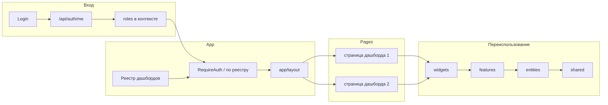

# Архитектура дашбордов (FSD): план

## Текущее состояние

- Маршруты: [App.tsx](../src/App.tsx) — `"/"`, `"/invite"`, `"/login"`; один общий Home.
- Авторизация: [AuthContext.tsx](../src/context/AuthContext.tsx) хранит `UserDto` с полем **`role: string`** (одна роль).
- API: [api/types.ts](../src/api/types.ts) — `UserDto`, `AuthResult`; доменных сущностей (департаменты, курсы, уроки) пока нет.

---

## 1. Цели архитектуры

- Новые экраны добавляются как «плагины» (новая запись в реестре + тонкая страница).
- Общий код не превращается в «god folder» — слои FSD: shared ← entities ← features ← widgets ← pages.
- API, состояние и виджеты переиспользуются между дашбордами.
- Каждый дашборд можно развивать почти независимо (сборка из виджетов и фич).

---

## 2. Структура папок (FSD)

```text
src/
  app/
    providers/           # Router, QueryClient, AuthProvider, theme
    routes/              # конфиг роутинга + реестр дашбордов
    layout/               # общий layout (sidebar, header, outlet)
  pages/
    login/
    invite/
    dashboards/           # тонкие страницы-компоновщики
      selector/          # выбор дашборда при нескольких ролях
      attendance/
      grades/
      schedule/
      admin-*            # страницы админ-дашборда
      teacher-*
      student-*
  widgets/
    kpi-cards/
    chart-panel/
    filters-bar/
    data-table/
  features/
    select-group/
    select-period/
    export-report/
    save-filter-preset/
  entities/
    group/
    student/
    teacher/
    schedule/
    department/
    course/
    lesson/
  shared/
    ui/                  # кнопки, инпуты, модалки, базовая таблица
    api/                 # http client (текущий client.ts) + базовые хелперы
    lib/                 # утилиты, форматтеры, хелперы дат
    config/              # env, константы, роли, feature flags
    types/               # общие типы (ErrorResponse и т.д.)
```

Правило зависимостей: слой может импортировать только из слоёв ниже (shared ← entities ← features ← widgets ← pages). Никаких импортов страниц в виджетах, виджетов в entities и т.д.

---

## 3. Реестр дашбордов

Единый конфиг (например `app/routes/dashboardRegistry.ts`):

- путь (например `/dashboards/attendance`);
- заголовок, иконка;
- **requiredRoles: string[]** — доступ по ролям;
- компонент страницы — через **React.lazy()**, чтобы каждый дашборд грузился отдельным chunk'ом;
- настройки пункта бокового меню (видимость по роли берётся из этого же конфига).

Добавление нового дашборда = одна запись в реестре + папка страницы в `pages/dashboards/<name>`. Сайдбар и защита маршрутов читают реестр и фильтруют по `user.roles`.

---

## 4. Роли и доступ

- В типах и контексте перейти от `role: string` к **`roles: string[]`** (если бэкенд отдаёт одну роль — обернуть в массив).
- AuthContext хранит `user.roles`, при необходимости хелперы `hasRole(role)`, `hasAnyRole(roles)`.
- После логина: одна роль — редирект на дашборд по умолчанию; несколько — страница выбора дашборда (`/dashboards` или `/dashboard`).
- Защита: `RequireAuth` + проверка по реестру (есть ли у пользователя одна из requiredRoles для текущего пути). При отсутствии прав — редирект на логин или 403 / страницу выбора.

---

## 5. Страница дашборда — компоновщик

Страница дашборда остаётся «тонкой»:

- какие виджеты на странице (filters-bar, chart-panel, data-table, kpi-cards);
- дефолтные фильтры (период, группа и т.д.);
- какие запросы/источники данных (через React Query в виджетах/фичах);
- какие права нужны (уже заданы в реестре).

Вся логика графиков, таблиц, экспорта — внутри widgets и features. Страница только собирает блоки и передаёт пропсы/контекст фильтров.

---

## 6. Контракт виджетов

Унифицировать входы виджетов, чтобы переиспользовать и тестировать:

- вход: фильтры (период, группа, курс, статус и т.д.), dateRange, timezone, locale — по необходимости, часть опциональна или через общий контекст (например DashboardFiltersContext).
- выход: UI.

Так можно подключать новые источники данных и переиспользовать одни и те же виджеты на разных дашбордах. Тяжёлый общий контракт не обязателен — достаточно соглашения по минимальному набору (например фильтры + период) и опциональному остальному.

---

## 7. Данные и состояние (три уровня)

| Уровень | Что | Где |
|--------|-----|-----|
| **Server state** | Данные с бэка (списки, отчёты, графики) | TanStack Query (React Query). Кеш, дедупликация, рефетч. Не хранить в глобальном сторе. |
| **UI state** | Модалки, сортировка, раскрытые блоки | useState/useReducer внутри виджета или страницы. |
| **Global app state** | Пользователь, роли, тема, язык | Context или лёгкий стор (Zustand). Только то, что реально глобальное. |

Правило: всё, что пришло из API — в Query, не в глобальном сторе.

---

## 8. API-слой: один вход, типизация

- **shared/api/** — http client (текущий [client.ts](../src/api/client.ts)), базовые хелперы, общие типы ошибок.
- **entities/*/api** — функции запросов по домену (departments, courses, lessons, groups, schedule и т.д.), вызывают shared api.
- **entities/*/model** — типы сущностей и маппинг DTO → frontend model, чтобы UI не зависел от формата бэка.

Не вызывать fetch напрямую из компонентов; все запросы через entities или shared. DTO типизировать и маппить в модели в слое entities.

---

## 9. Entities: доменная модель

В **entities** живут сущности университета: Group, Student, Teacher, Schedule, Department, Course, Lesson и т.д.

- **entities/*/model** — типы, интерфейсы, связи (например course.departmentId, lesson.courseId).
- **entities/*/api** — запросы к бэку, возвращают данные в типах из model (после маппинга DTO).

Повторяющиеся элементы (департаменты, курсы, уроки, группы, расписание) используются во всех дашбордах через одни и те же entities. Отличия дашбордов — только набор страниц и виджетов и пункты меню в реестре.

---

## 10. Схема потоков



---

## 11. Порядок внедрения

1. **shared:** перенести/оставить api (client), вынести общие типы в shared/types, config (env, константы, роли).
2. **Роли:** расширить UserDto/AuthResult до `roles: string[]`, обновить AuthContext, хелперы hasRole/hasAnyRole.
3. **app/routes:** конфиг маршрутов, реестр дашбордов (path, title, requiredRoles, lazy-компонент, меню). Защита RequireAuth + проверка по реестру.
4. **app/layout:** общий layout с сайдбаром и outlet; пункты меню из реестра с фильтром по user.roles.
5. **entities:** по одной сущности (например department, course, lesson, group, schedule) — model + api, маппинг DTO → model.
6. **widgets:** базовые виджеты (filters-bar, data-table, chart-panel, kpi-cards) с согласованным контрактом (фильтры/опции опционально или через контекст).
7. **features:** select-group, select-period, export-report, save-filter-preset — переиспользуемые действия.
8. **pages/dashboards:** тонкие страницы-компоновщики для каждого дашборда, подключение виджетов и фич, дефолтные фильтры.
9. **React Query:** подключить TanStack Query в app/providers; серверное состояние в запросах внутри entities/widgets/features, не в глобальном сторе.

После этого новые дашборды добавляются записью в реестре и новой тонкой страницей, общий код живёт в shared/entities/features/widgets без «god folder», API и виджеты переиспользуются, каждый дашборд развивается за счёт композиции виджетов и фич.
